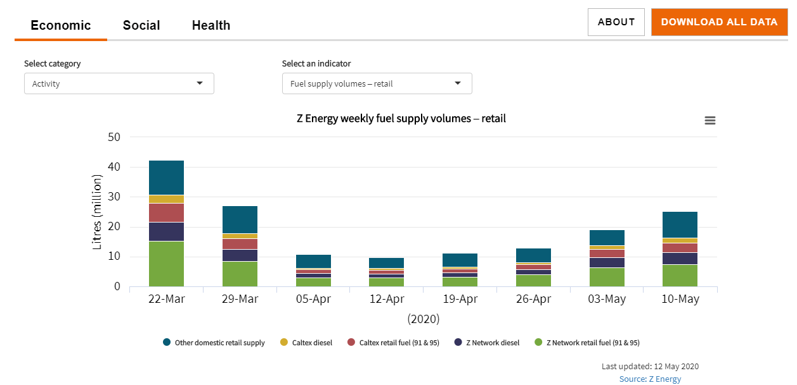
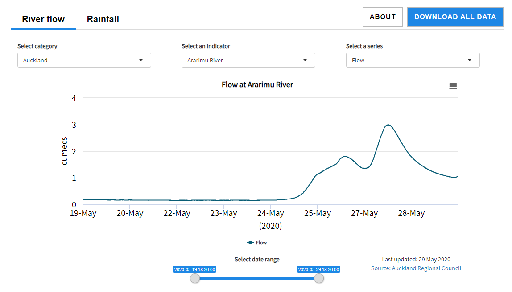
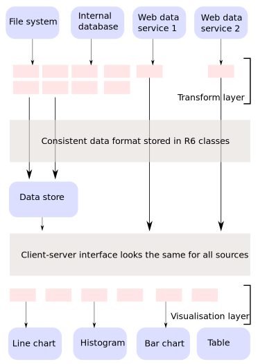

# Data portal

:)
 
This is a generic data portal written in Shiny R.  It is designed for making the display and management of a large number of disparate data sets simple and easy.

The current version of this code is used for the Stats NZ COVID-19 Data Portal here:

https://www.stats.govt.nz/experimental/covid-19-data-portal

---
__Copyright and Licensing__

The package is Crown copyright (c) 2020, Statistics New Zealand on behalf of the New Zealand Government, and is licensed under the MIT License (see LICENSE file).

<br /><a rel="license" href="http://creativecommons.org/licenses/by/4.0/"></a><br />This document is Crown copyright (c) 2020, Statistics New Zealand on behalf of the New Zealand Government, and is licensed under the Creative Commons Attribution 4.0 International License. To view a copy of this license, visit http://creativecommons.org/licenses/by/4.0/ or send a letter to Creative Commons, PO Box 1866, Mountain View, CA 94042, USA.

## Introduction

The publication of a large number of unique data sets in a user friendly visualisation can present a challenging problem.  This is often solved through the production of a specialised *dashboard* for the particular data set and audience.  However, these solutions can become complicated, expensive to maintain and can be difficult to recycle for new data.  This is often because dashboards are built to be highly specific and over-engineered for the given data set, where a desire to show a large number of unique visualisations has limited the the ability to generalise the software for other uses.



The advantage of dashboards over a traditional publishing process is that they enable the user to generate insights based on their needs.  Data sets may come with many regional, industry and social (to name a few) dimensions that are difficult to properly represent through a choice of only a handful of graphs.  There is a need for a solution which enables rapid publication of large numbers of different data sets in a semi-automated but flexible way.

We present here a simple solution for these problems.  This data portal software is a framework for building a range of similar data dissemination tools, with a robust data management process combined with sufficient flexibility to work with a range of data sources and visualisation requirements.

This software is the basis of the COVID-19 Data Portal, which was published on the experimental Stats NZ website in April 2020.  The structure of the code has enabled this portal to grow to holding over 300 different time series from a large range of different input formats.  The code was further generalised into the current state in May 2020 to allow for quick deployment of similar portals.  In the figure below we show the same software used to display environmental data directly from a web based data service.



This documentation describes the data management principles and software.  The intended use of this documentation, and the associated code, is for the reuse of this solution for rapid production of data visualisations.


# The data management process



For this application to be able to scale quickly and be reused for a range of needs there must be a robust and flexible data management process.  In the figure above we show the process map for the various types of data sources and how these flow through the system.

In the figure we show four possible sources of data at the top.  These represent the first steady-state.  The original raw data is read in using either one of the predefined functions, or by writting a custom function if a new source is required (such as a new web service).  For a file this is as simple as pointing to the correct directory, so there is little abstraction required -- but web services or database calls may require specific functions.  This raw data is then passed into the transformation layer.  This layer may contain many custom *load functions* designed to transform raw data into a consistent format.  The output of these load functions must be a type defined in `R/data_types.R`.  If a suitable structure is not available then one can be defined in that file.

Internal data is then passed into the *data store*.  This is simple list containing all the data sets saved into a file on the harddrive.  This file is then deployed with the application.

Finally all data is accessible through the client-service interface.  From the perspective of the client this layer is called in the same way with the same behaviour regardless of the data source, returning one of the expected data types.  This data is then passed through the visualisation layer, where custom plot functions may be defined for alternative visualisations of data.

See below for details on how to build functions for each of the layers in this process.

# Code documentation

This section outlines how to work with data portal software including how to define new visualisations and create custom functions for the data management process.

## Code style

The code in this project generally follows the Google style guide (https://google.github.io/styleguide/Rguide.html) which is an extension of the tidyverse style guide. Consistency with the basic formatting rules can be checked by running `shiny::runTests()`, which will run the linting package over the source code. If a file causes an error, then you can check the linting of that file by running `source("tests/linters.R")` followed by `lint_file(filename)`. This will give you the errors based on the choosen linters.

The following standards are not checked automatically by the linter so are worth noting:

- Do not use unnecessary white space lines, no more than a single empty line to be used to improve readability (unfortunately there is no linter for this, that I could find).
- Use literal function and parameter names unless the intention is clear.  For example, `data`, `result` and `output` are acceptable when the purpose of these are clear (such as within a clearly named function returning the result data frame), but if you find yourself using `data2` or `result2` then consider using more descriptive names.  Single variable names such as `x` should be avoided (exluding when used as iterators, such as in a for loop).
- Keep functions short.  Do not create functions which do a number of complicated steps, instead break these out into smaller functions, even if you only intend to call these functions once.
- Do not nest functions inside other functions.

## Tests

There are currently no unit or integration tests other than those which run the linter.  Before deployment the application can be smoke tested by running, checking the graphs render and downloading the file.  The download file function iterates through all indicators, so will generally crash if there is an issue.  To debug, put a print statement in the ```get_download_csv.R``` file to determine which ```key``` is causing the function to crash.

## Examples

To get started with the generic data portal code it is good to try the examples.  To run the most basic example:

- Copy the file `config/example/example_config.yaml` into a new file called `config/config.yaml` (this file is not to be kept under version control as it's specific to each portal).
- Run the script `scripts/run_load_process.R` to load the data into an RDS file.
- Run the command `shiny::runApp(".")` to start the application.


This will use the indicator and data definitions defined in `config/example_indicators.json` and `config/example_data_definitions.json` to create a visualisation from the data in the 'example_data/' folder.  These can be changed in the `config/config.yaml` file, see Section 'sec:config_file' for details.  To run a more sophisticated example that uses data purely from a web based service run the application with the following steps.

- Copy the file `config/api_example/api_example_config.yaml` into `config/config.yaml`
- Run the command `shiny::runApp(".")` to start the application.

Note that in this case we did not need to load to an RDS file as all data comes from a web service.

## The configuration file

The configuration file is a YAML file of key-value pairs that is loaded in at the start of the application.  This file controls the look and feel of the application and defines the file paths to other configurable parts of the application, along with any other adjustable parameters.  The file must have the path `config/config.yaml`.  This avoids the need for any definitions in the R code itself, making it easier to maintain and configure.  An example of the configuration file contents in given in the Figure below.

The configuration parameters and meaning are:

- `title` - The name to appear in the about and download modals.
- `production` - for data coming from files on the file system read from the files at Shiny application start up (if `false`) otherwise read from the RDS file if (`true`) (requires running the load data script first to create the RDS file).
- `data_directory` - If reading data from the file system what directory are the files stored in (*optional*).
- `indicator_definitions` - file path to the indicator definitions JSON file.
- `data_definitions` - file path to the data definitions JSON file (*optional*).
- `default_parameters` - a list of default parameters to use if these are not found when looking in the indicator or data definition files (*optional*).
- `primary_color` - the brand color for the application.
- `data_store_filename` - the RDS file for storing data from the file system (used for both reading and writing) (*optional*).
- `about_modal_html` - HTML file for the content to appear in the about modal.
- `download_modal_html` - HTML file for the content to appear in the download modal.
- `tag_manager_html` - HTML file containing the Google Analytics tag manager code (*optional*).

```
title: "COVID-19"
production: true
data_directory:  "~/COVID-19 data_Secure/COVID-19_dashboard/"
indicator_definitions: "config/covid_19/covid_19_indicators.json"
data_definitions: "config/covid_19/covid_19_data_definitions.json"
default_parameters:
  data_type: "TimeSeries"
  plot_function: "get_time_series_plot"
  data_service: "load_from_store"
primary_color: "#EC6607"
data_store_filename: "data_store.RDS"
about_modal_html: "www/about_covid_19.html"
download_modal_html: "www/download_modal_covid_19.html"
tag_manager_html: "www/tag_manager.html"
```
Example configuration file.  This file controls the overall appearance of the application and defines the location of various other files which are specific to the particular product.

## Defining indicators

Indicators are defined in a JSON format configuration file.  For each indicator a block of JSON defines all properties such as the title, labels, the source of the data and any additional parameters required to request that data.

All visualisations (each chart of graph) in the application must have a unique key, which is a concatenation of

- The \codeword{class}
- The \codeword{type}
- The \codeword{indicator_name}
- The \codeword{name} parameter of the group

These parameters are defined in the corresponding JSON, with an example given below.  These four parameters will uniquely define the tab selected, the three choices of the drop down selectors at the top of the page and as a result a data source and a visualisation.

The possible parameters for an indicator definition are:

- `class` -- The tab the indicator will appear on.
- `type` -- The first drop down selector.
- `indicator_name` -- The second drop down selector.
- `title` -- the title to appear on the graph.
- `source` -- the name of the data source.
- `source_url` -- the URL for the data source.
- `plot_function` -- the name of the plot function.
- `international` -- `true` or `false` will determine grouping in indicator list.
- `download` --  `true` to include this indicator in the download CSV file.
- `data_service` -- the data service to use to fetch the data.
- `include_date_slider` -- `true` to include a data slider.
- `default_lower_range` -- the lower date range in the format ``YYYY-MM-DD''.
- `caveats` -- HTML or text for contents of caveat box (text block below graph with orange border).
- `description` --  HTML or text for contents of description box (text block below graph).
- `groups` -- an array of JSON blocks with the following parameters:
- `name` -- the option in the third drop down box.
- `title` -- the title (if different to above).
- `units` -- the units to appear on the y-axis label.
- `data_service` -- the data service (if different to above).
- `caveats` -- caveats text or HTML (if different to above).
- `description` -- description text or HTML (if different to above).

Parameters defined in the indicator definition are generally returned using the function `get_indicator_parameter`.  This function will first check the `group` block of parameters for the required parameter, and if it is not found, will use the value at the indicator level.  This allows for specific parameters to be applied at the group level when necessary.


Example indicator definition is given below.  This block of JSON defines everything about the indicator including how it will look in the application and where the data will come from.
```
  {
    "class": "Economic",
    "type": "Transport",
    "indicator_name": "Flight departures by main airports",
    "source": "Flightradar24",
    "plot_function": "get_time_series_plot",
    "international": false,
    "source_url": "https://www.flightradar24.com/data/statistics",
    "download": false,
    "groups": [
      {
        "name": "Auckland Airport",
        "title": "Daily departures - Auckland Airport",
        "units": "Number"
      },
      {
        "name": "Wellington Airport",
        "title": "Daily departures - Wellington Airport",
        "units": "Number"
      }
    ]
  }
```

## Reading data from the file system

Data may be read from the file system prior to deployment of the application and stored in a temporary data store.  This data store is a single file with all data stored in a consistent format (one of the data models defined in `R/data_types.R`.  This is preferred over deploying the application with many different files as the initial load can be extended significantly due to the time to read these in.  To load files into the data store before deployment the data sets must be defined in a `data_definitions.json` file.  Below we show the example corresponding to the indicator defined above.  Like the indicators, each data set can be read into a unique key-value pair in the data store, defined uniquely by the `class`, `type`, `indicator_name` and `group_names`.  Note that in this example the same file will be read into two different key-value pairs, corresponding to the two unique visualisations defined in in the indicator block above.

It is also possible to add data into the same key-value pair in the data store from multiple files.  In the `data_types.R` file there are addition operators defined for the R6 classes holding the data, and these will be employed if there is another definition in the `data_definitions.json` file which points more data at an existing key-value pair.  However, this will obviously fail if the `data_type` parameters are different.

The possible parameters in the `data_definitions.json` file varies depending on the load function used.  For new load functions we are trying to put all load function specific parameters into a separate group called `load_parameters` to make it clear these are specific to that function, although this is not a global rule yet.  Some common parameters are:

- `class` -- The tab the indicator will appear on.
- `type` -- The first drop down selector.
- `indicator_name` -- The second drop down selector.
- `load_function` -- the name of the load function to use to read the file.
- `filename` -- the file name.
- `data_type` -- the data type, such as ``TimeSeries''.

Some common parameters which are used in the `read_from_excel` load function and appear in most of our data definitions:

- `sheet_number` -- the sheet in the Excel file to read from.
- `parameter_col` -- the column which contains the independent variable, such as the date for a time series or category for a bar chart.
- `value_cols` -- the columns which hold the data values.
- `value_names` -- the names for each set of values - will appear in the legend of the graph and of particular importance when there will be multiple lines on the same graph.
- `group_names` -- the string which corresponds to the name of the group block in the indicator definition.  This will generally match the `value_names` or be -the same for all values if you want to assign multiple lines to one graph.
- `drop_na` -- if `true` will drop rows of data that have `NA` values.
- `skip` -- lines to skip at the start of the sheet.
- `input_units` -- array (if different for each column) or single value for the scaling of values.  For example if set to 1000 all values will be multiplied by 1000 on when loaded.
- `parameter_transform` -- an inline R function defining how to convert the parameter into the desired for, for dates this is often something like ``function (x) ymd(x)``.

Data definition example below.  This block of JSON tells the application how to load and transform data from a file into the RDS store.
```
      {
        "class": "Economic",
        "indicator_name": "Flight departures by main airports",
        "type": "Transport",
        "parameter_col": 1,
        "parameter_transform": "function(x) ymd(x)",
        "sheet_number": 1,
        "value_col": [2, 3, 4],
        "value_names": ["Auckland Airport", "Wellington Airport"],
        "group_names": ["Auckland Airport", "Wellington Airport"]
        "filename": "Daily flight departures.xlsx",
        "load_function": "read_from_excel",
        "data_type": "TimeSeries"
      }
```

## Custom functions

This code is designed to provide a robust structure for data management while allowing maximum flexibility in both the input data and the visualisations.  In the data process figure above we show the customisable layers in the process flow.  Each of these layers can be modified using custom functions, such as custom load functions in the transform layer, plot functions in the visualisation layer, or even entirely new data sources in the very first layer.  It is also possible to construct new data models, if the TimeSeries or BarChart classes do suit your needs (for example geographical data may need a new data model to be created).  In this section we describe the customisable parts of the code.

### Load functions

Load functions are used to read data from a range disparate file formats.  If particular data set is going to be delivered regularly in a consistent format it is preferable to simply write a custom load function, rather than manually changing the file or requesting that your data supplier does it for you (which can create burden on them, ultimately slowing down supply and potentially limiting the likelihood of being provided more comprehensive data in future).  So we have the ability to write short functions for handling the different formats we can encounter.

The load functions are currently defined in `R/load_functions.R`.  When a new load function is defined it must be added to the list at the end of this file so it can be referenced by a key, as defined in the configuration file. Each load function must return a named list of data objects (of a type defined in `R/data_types.R`), with names equal to the name of the group defined in the indicator definition that it corresponds to.

The internal details of a load function are entirely up to the developer, as long as it takes in a configuration object (from the `data_definition.json` file or equivalent) and returns a named list of data objects.  However, it is recommended that if a load function can be generalised, and code reused for other indicators with a simple change in input parameters, then this should be done to avoid create a large amount of additional code to maintain.

### Data models

Currently we have two data models, a TimeSeries and a BarChart, they are defined in R6 classes in `R/data_types.R`.  These classes give additional structure to our data, with every indicator having to conform to one of these types.  The classes also have methods for extracting the data to go in the download CSV.

New data models can be created in this file.  The only considerations are that they need to have a method `get_csv_content` which returns the data in a long table format with a column for sub-series name.  The way data models with with the download function needs to be extended to enable more generic types, as the current system is somewhat rigid.

### Data services

Data services define the first line in our process flow.  We currently have implemented `load_from_store` which reads from the saved RDS file deployed with the application, `load_from_web_service`, an example of calling a basic web service and `load_from_environmental_data` which demonstrates how to call data from a well structured API, along with some manipulation to the received data.

Web based data service functions may also make use of load functions, which can be defined in the usual way.

To define the data service change the `data_service` parameter in the indicator definition to a function defined in `R/data_service_functions.R`.  In these functions we define how to call a specific web service and interpret the data, returning a data object that conforms to one of our data models.

## Custom visualisations

It is possible to display any type of visualisation in this application by defining custom plot functions.  The plot functions are defined in `R/plot_functions.R`.  All that is required is a function which takes in one of the accepted data models (a new one can be created if required) and returns a highcharter object.

### The regional filter

The regional filter was added to the COVID-19 Data Portal in response to a need to understand the impact of COVID-19 at a regional level.  This filter breaks some of the generality of the portal, as not all data sets will make sense to have a regional filter.

The filter works by identifying the names of the regions within certain fields in the indicator definitions.  This logic occurs in the file `R/core/filter_indicators.R`.  The regions available in the filter are defined in `R/core/consts.R`.  The filter is then applied at the highest level, within the `server.R` file, and only the filtered indicators passed down to the components.

The regional filter and functionality could be extended to be more general, and allow search functionality.  Ideally the filter will be a general filter, with it possible to define via a configuration what types of fields to filter on, and what the possible values are (these could either be in configuration as well, or retrieved from the indicator definitions).
